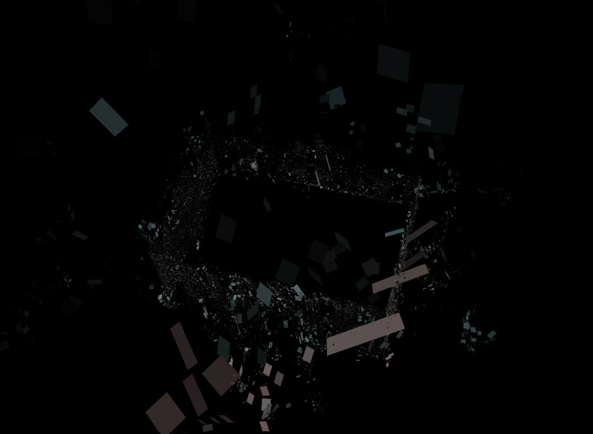

# goonr
Gaussians Optimized On Rust.

## About
I'm learning Rust. This is my first ML project on Rust.
Currently only rendering quads.

## How to
Run backend crated with `cargo run --release` and frontend with `trunk serve --open`.
Use mouse to move/zoom camera.

## Current state
- Renders only quads
- Can handle up to 100000 quads on a Nvidia RTX 2060

### Screenshots
